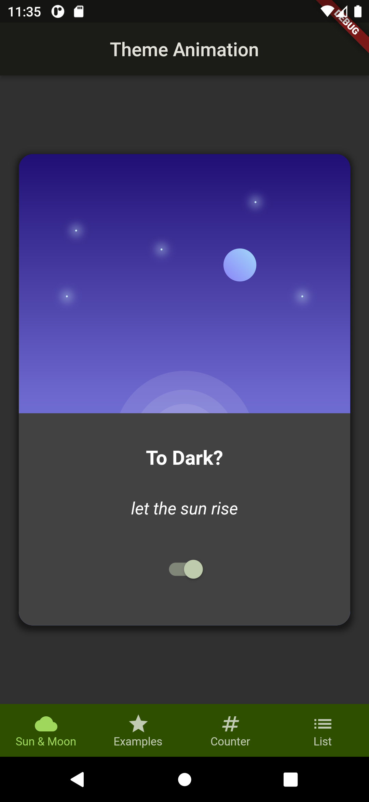

# Flutter Basic

## Contents

- [Description](#description)
- [Download](#download)
- [Features](#features)
- [Requirements](#requirements)
- [Installation](#installation)
- [Screenshots](#screenshots)

---

## Description

**Flutter Basic** in this repository I learn how to develop android and ios app with flutter. It's just a simple app to understand the basic of flutter.

---

## Download

### choose apk for your device

### [Click Here to Download](https://github.com/sipamungkas/flutter-basic/releases/tag/v.1.0.0)

---

## Features

- some animation
- some list view
- how to use provider
- etc

---

## Requirements

- `provider: ^6.0.5`

---

## Installation

1. Open your terminal or command prompt
2. Clone the project

```bash
$ git clone git@github.com:sipamungkas/flutter-basic.git
```

3. Move inside the directory and install and link dependency

```bash
$ cd flutter-basic
$ flutter pub get
```

4. Run program

```bash
$ flutter run
```

---

## Screenshots

<div style="text-align:center">



## </div>
